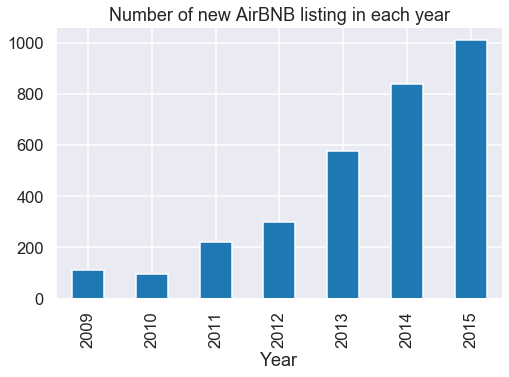

*Photo via iStock.com/lisegagne*

As a Bostonian for almost 2 years, I have lived in Boston at several places. While wandering around different neighborhoods of this fabulous city, I am always wondering, **what would it be like to live in this neighborhood?** 

And as summer is coming, which is the best season of the city, I have noticed that the traffic has become heavier than usual when I get to work, and even is heavier than the same time last year. This also makes me wondering, **how busy is the summer time in Boston?** **By how much do hotel or AirBNB prices spike during this season?** And **is there a general upward trend of both new Airbnb listings and total Airbnb visitors to Boston?**

With these questions in mind, I found the [Boston AirBNB Data](https://www.kaggle.com/airbnb/boston) on Kaggle. Let's explore the data and find out the answer to my questions!

The code for analysis and generating the data visualization can be find in this [GitHub repo](https://github.com/zhiruiwang/Boston_AirBNB/blob/master/Boston-Airbnb.ipynb)

## The vibe of each Boston neighborhood
Maybe many of you are not from Boston area and do not have a clear view of which part of Boston is what, below is a map of Boston with all the neighborhood and districts of Boston:

*Photo via maps-boston.com*

When we group by the neighborhood of each listing  in the AirBNB data, here is a bar chart showing the frequency of listing in each neighborhood:

We can see that the majority of the AirBNB housings are in the south-western side of Boston, which makes total sense since the north-eastern side is all harbor, port and airport area.

Word cloud is a fantastic way to visualize text data. After we split the sentences into indivisual words(a.k.a tokenization), and count the frequence of each word. Because we want to see the unique vibe of each neighbourhood, so we want those common words that have high frequence across all neighborhoods to be down weighted. We can do this by deviding the word frequence within each neighborhood by frequence between neighborhoods. 

After that, we can display the words on a plot with random order, with its weighted frequence as the size of the text, which makes the plot looks like a word 'cloud'. Here are the word clouds for the top 10 neighborhoods in Boston:

Jamaica Plain:

South End:

Back Bay:

Fenway:

Dorchester:

Allston:

Beacon Hill:

Brighton:

South Boston:

Downtown:

Although for most of of the neighborhood, there are some common words like 'room' and 'apartment', but we can still find some good insights if we look carefully.

For example, for Jamaica Plain, it has word 'pond', which should refer to the beautiful Jamaica Pond. And the word 'JP' may refer to my favorite ice cream store J.P. Licks, which is originated from Jamaica Plain!

*Photo via jplicks.com*

Another example, for Beacon Hill, it has word 'historic', should refer to the wonderful colonial style of that area. The word 'common' should refer to the Boston Common, Bostonians' weekend go-to place. And the word 'charles' is refering to the Charles river next to the hill! I am wondering what would be the price of a AirBNB house on the Beacon Hill that hase both view of Boston `Common` and `Charles` river, with `historic` style. Must be so expensive!

*Photo via bostonmagazine.com*

## What are the busiest times of the year to visit Boston? By how much do prices spike?
Based on my experince, my first thought would be summer is the busiest time in Boston, since I have seen tons of people on the Charles River sailing, sitting outside a pub, or touring along the freedom trail, mostly in July, August and Spetember. However, after I use AirBNB data from 2016 to 2019 and do a group by on the month, I am pretty surprised:

On the one hand, I am correct that 7, 8 and 9 are among the highest months across year. But on the other hand, why the top is the October? What is the best of Boston in Octorber? Right, the foliage!

*Photo via globalimmersions.com*

Actually in the summer, although there are crowds among the city, lots of them are local Bostonians. But during the fall season, there will be a lot of people across the country coming to Boston to see the foliage, which makes October the peak month of the year for AirBNB.

After we adress the frequency question, let use think through the monetary question. Based on the demand and supply relation, the busiest time should have the highest average price, while the slowest whill have the least. Let's see from the data whether it is the case.

Above is the plot that group 2016-2017 data by month and calculate the average price. It is true that for the top two month, September and October, the price are the highest. However, for the rest of the months. it seems like the price is pretty flat, around 175 - 200, which is not cheap. Just like the hotel price of Boston is one of the craziest in the US, the AirBNB is also cathcing up ☺

## Is there a general upward trend of both new Airbnb listings and total Airbnb visitors to Boston?
AirBNB is a growing business across the world, I believe it is also true in the Boston area. Let's use 2019-2015 AirBNB listing data to check how many new listings are posted every year:

We do can see a rapidly increasing trend in the new AriBNB in Boston.

And as stated in the beginning, I am seeing more and more tourists year by year to Boston. Let's also use data to verify that:

Above plot is generated using 2010-2015 AirBNB review data. We can also see an even more rapidly trend in the AirBNB user.

**One intersting question** would be, what is the causality between the new AirBNB listing and AirBNB visitors? Is it becasue more AirBNB homes are opened, so more visitors are attracted to Boston, or is it because more visitors are coming, so more AirBNB are opened so they know it is a good chance to own money? Or is it possible they are mutal causality? This questions can not be addressed by summary statistics, it need more advanced techniques like causal inference and Bayesian networks. If you have interest, definitely checking out those concepts on Google!
